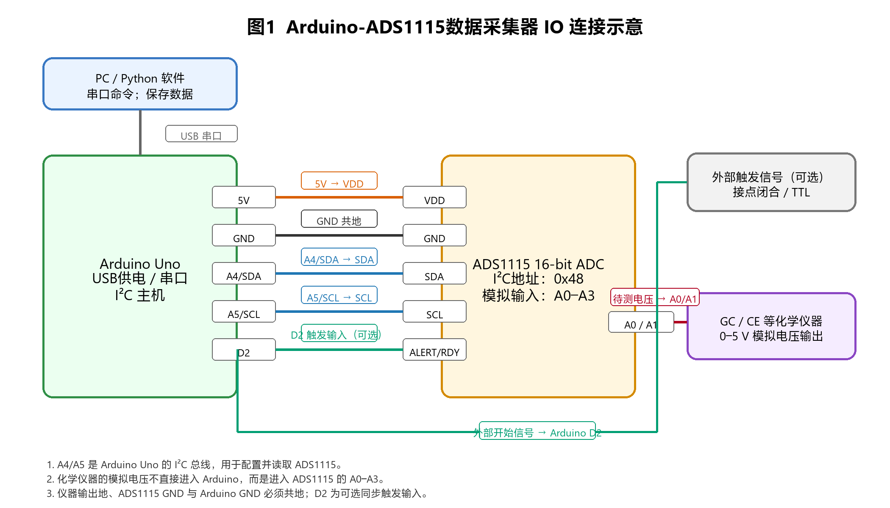

# 一、Arduino部分：文献选择与总体逻辑

## 1. 文献信息

- **文献标题**：An Inexpensive, Open-Source USB Arduino Data Acquisition Device for Chemical Instrumentation
- **文献引文**：Grinias, J. P.; Whitfield, J. T.; Guetschow, E. D.; Kennedy, R. T. *Journal of Chemical Education* **2016**, *93* (7), 1316–1319. DOI: 10.1021/acs.jchemed.6b00262.
- **选题说明**：该文献不在课程讨论区已申报的文献列表中。它属于化学仪器/分析化学教学场景，核心是将 Arduino Uno 与高分辨率 ADC 结合，替代价格较高的商业 USB 数据采集卡。

## 2. 文章总体逻辑

许多化学实验并不需要复杂控制，而是需要把仪器输出的电压信号稳定地记录到电脑中。例如气相色谱的热导检测器、毛细管电泳的紫外检测器、安培检测器或自制传感器电路，最终常输出随时间变化的电压。传统做法通常使用商业 USB 数据采集卡，但其价格和软件授权成本较高，在本科教学实验中批量配置会增加负担。

文章提出的逻辑是：

1. 以 **Arduino Uno** 作为低成本、易复制的微控制器和 USB 串口接口；
2. 用 **ADS1115 16 位模数转换器** 弥补 Arduino Uno 自带 10 位 ADC 分辨率不足的问题；
3. 由电脑端 Python 程序选择串口、通道、采样速率、文件长度和保存路径；
4. 将采集结果保存为制表符分隔文本文件，便于用 Excel、Origin 或 Python 后处理；
5. 用实际化学实验验证：一是本科分析化学实验中醇类的 GC-TCD 分离，二是研究级 CE-UV 仪器中硫脲、多巴胺和丝氨酸分离。

因此，文章不是单纯介绍 Arduino 教具，而是把 Arduino 放在“化学仪器信号采集链”中：化学过程产生的检测器响应 → 转换为模拟电压 → 高分辨率 ADC 读取 → Arduino 串口传输 → 电脑软件记录。

## 3. 创新点

1. **用低成本开源硬件替代商业采集卡**：文章给出的系统总成本低于 50 美元，而具有 16 位采集能力的商业设备通常价格高得多。
2. **分辨率设计合理**：Arduino Uno 自带 ADC 只有 10 位，直接读取 0–5 V 信号时每一档约 4.9 mV；改用 ADS1115 后可达到 16 位量化，适合色谱、电泳等需要观察峰形的小信号变化场景。
3. **软硬件均易复制**：硬件为 Arduino Uno、ADS1115、面包板和跳线，软件用 Python 实现图形界面和数据保存，不依赖昂贵授权。
4. **面向真实化学仪器验证**：文章用 GC-TCD 和 CE-UV 两个实例说明，该装置不只是课堂演示，而可与已有仪器的模拟输出端连接。
5. **教学价值高**：学生可以同时理解检测器信号、模数转换、采样率、分辨率、串口通信和数据处理，从而把化学仪器原理与自动化控制联系起来。

# 二、Arduino在装置中的作用

## 1. 功能定位

在该系统中，Arduino 不是直接作为化学传感器，而是作为**电脑与高精度 ADC 之间的接口控制器**。它完成三类任务：

- **电源与通信桥梁**：电脑通过 USB 给 Arduino 供电，并通过串口发送采集参数、接收采样数据。
- **I²C 主机**：Arduino 通过 I²C 总线控制 ADS1115，设置通道、量程和采样速率，并读取转换后的数字量。
- **触发与同步接口**：文章提到可用数字输入检测外部仪器触发信号，因此 Arduino 可在仪器开始运行时同步启动采集。

## 2. IO连接图



## 3. IO口与硬件逻辑说明

| Arduino Uno IO | 连接对象 | 作用 | 程序逻辑 |
|---|---|---|---|
| USB | 电脑 | 供电与串口通信 | `Serial.begin()` 初始化串口；接收电脑端采样参数；输出时间戳和电压值 |
| 5V | ADS1115 VDD | 给 ADC 模块供电 | 不需代码控制，但必须保证与信号范围匹配 |
| GND | ADS1115 GND、外部仪器地 | 共地，确定电压参考点 | 程序不能弥补未共地导致的漂移，硬件连接必须正确 |
| A4/SDA | ADS1115 SDA | I²C 数据线 | `Wire`/ADS1115库通过 SDA 发送配置、读取转换结果 |
| A5/SCL | ADS1115 SCL | I²C 时钟线 | Arduino 作为 I²C 主机给出时钟 |
| D2（可选） | 外部触发/继电器闭合信号 | 等待仪器开始信号 | `digitalRead(TRIG_PIN)`，检测上升沿或低电平闭合后开始记录 |
| ADS1115 A0–A3 | 仪器模拟输出 | 采集 0–5 V 或经分压后的电压 | 由程序选择通道并调用 `readADC_SingleEnded(ch)` |

其中最重要的是 **A4/A5 的 I²C 通信**。ADS1115 完成真正的高分辨率模数转换，Arduino 负责告诉 ADS1115“读哪个通道、用什么增益、以多快的速率采样”，再把读数传给电脑。若选择单端输入，仪器信号线接 ADS1115 的 A0，仪器地接 GND；若要降低噪声，也可采用差分输入，例如 A0-A1。

# 三、源代码与IO代码逻辑分析

文章支持信息提供了电脑端 Python 软件；若需要在 Arduino 端实现同样功能，可以编写如下简化版固件。它保留了文章装置的核心工作过程：串口接收命令、I²C 读取 ADS1115、可选外部触发、按设定采样间隔输出时间和电压。

```cpp
#include <Wire.h>
#include <Adafruit_ADS1X15.h>

Adafruit_ADS1115 ads;

const int TRIG_PIN = 2;          // 可选：外部仪器触发输入
int channel = 0;                 // ADS1115 A0为默认通道
unsigned long interval_us = 2000; // 500 Hz，对应文章中软件限制的最高采样率
bool waitTrigger = false;

void setup() {
  pinMode(TRIG_PIN, INPUT_PULLUP);
  Serial.begin(115200);
  Wire.begin();                  // Uno: A4=SDA, A5=SCL

  if (!ads.begin(0x48)) {        // ADDR接GND时地址为0x48
    Serial.println("ERR,ADS1115 not found");
    while (1);
  }
  ads.setGain(GAIN_TWOTHIRDS);   // 量程约±6.144 V，适合0–5 V输入
  Serial.println("READY");
}

void parseCommand(String cmd) {
  // 命令例：CH=0;RATE=500;TRIG=0
  int p = cmd.indexOf("CH=");
  if (p >= 0) channel = cmd.substring(p + 3, p + 4).toInt();

  p = cmd.indexOf("RATE=");
  if (p >= 0) {
    int rate = cmd.substring(p + 5).toInt();
    if (rate > 0 && rate <= 500) interval_us = 1000000UL / rate;
  }

  p = cmd.indexOf("TRIG=");
  if (p >= 0) waitTrigger = cmd.substring(p + 5, p + 6).toInt() == 1;
}

void loop() {
  if (Serial.available()) {
    String cmd = Serial.readStringUntil('\n');
    parseCommand(cmd);
    Serial.println("time_ms,channel,voltage_V");

    if (waitTrigger) {
      // 低电平表示继电器闭合或仪器触发到来
      while (digitalRead(TRIG_PIN) == HIGH) { delay(1); }
    }

    unsigned long next_t = micros();
    while (true) {
      if (Serial.available()) {
        String stopcmd = Serial.readStringUntil('\n');
        if (stopcmd.startsWith("STOP")) break;
      }

      int16_t raw = ads.readADC_SingleEnded(channel);
      float volts = ads.computeVolts(raw);

      Serial.print(millis());
      Serial.print(',');
      Serial.print(channel);
      Serial.print(',');
      Serial.println(volts, 6);

      next_t += interval_us;
      while ((long)(micros() - next_t) < 0) { }
    }
  }
}
```

## 代码逻辑对应的IO分析

- `Wire.begin()` 启动 I²C，总线实际对应 Arduino Uno 的 **A4/SDA 和 A5/SCL**。这两根线不是采集模拟电压，而是传输 ADC 的配置字和转换结果。
- `ads.begin(0x48)` 对应 ADS1115 地址选择。当 ADDR 接 GND 时地址为 0x48；如果实验室有多个 ADC，可以改变 ADDR 接法以避免地址冲突。
- `ads.setGain(GAIN_TWOTHIRDS)` 对应输入量程设置。由于许多仪器模拟输出可达 5 V，选择约 ±6.144 V 的量程可避免过量程；若信号更小，可调高增益提高分辨率。
- `readADC_SingleEnded(channel)` 读取 ADS1115 的 **A0–A3**。这些端口才是与化学仪器电压输出直接相关的端口。
- `TRIG_PIN = 2` 是可选数字触发输入。当仪器给出开始信号或继电器闭合时，Arduino 才开始采样，避免数据文件前端出现过长空白段。
- `Serial.print()` 通过 USB 虚拟串口把采集结果发到电脑，由 Python 或串口终端保存为文本文件。

# 四、物联网部分：实验室智能通风与安全监测系统

## 1. 应用场景

参考智能家居的“传感器—网关—云端/手机—执行器”模式，可以设计一个**实验室智能通风与安全监测系统**。其目标不是替代规范操作，而是在实验室无人值守、夜间反应或多人共用通风橱时，提供实时环境记录、异常报警和联动控制。

## 2. 系统组成

- **传感端节点**：每个通风橱或实验台布置一个 ESP32/Arduino 兼容节点，连接 VOC 传感器、CO₂ 传感器、温湿度传感器、烟雾传感器和门磁/窗磁。
- **执行器**：继电器控制排风机档位、蜂鸣器、警示灯；必要时控制电磁阀切断惰性气体或可燃气体支路。
- **通信层**：节点通过 Wi-Fi 或 LoRa 将数据传到实验室网关，使用 MQTT 协议发布数据。
- **平台层**：本地服务器或云平台保存数据并绘制曲线，手机端推送报警。
- **权限与记录**：刷卡或二维码绑定实验人员，异常事件自动记录时间、位置、传感器值和处理人。

## 3. 工作流程

1. 正常状态下，每 10–30 s 上传 VOC、温度、湿度、CO₂ 和排风状态。
2. 当 VOC 或烟雾超过阈值时，系统先在本地声光报警，同时自动提高排风量。
3. 若 2–5 min 内浓度仍上升，则通过微信/邮件/短信通知值班同学和老师。
4. 若检测到夜间无人但通风橱门未关闭或温度异常升高，系统记录并推送提醒。
5. 所有数据形成历史曲线，用于判断通风橱是否老化、实验习惯是否合规，以及是否存在长期低浓度泄漏。

## 4. 创新与可行性

该方案把智能家居中的烟雾报警、空调联动和远程通知迁移到化学实验室。它的创新点在于：

- 关注化学实验室常见风险，如挥发性有机物、局部过热和通风橱使用不规范；
- 将传感器数据与执行器联动，不只是显示数值；
- 通过 MQTT 架构方便扩展，每增加一个实验台只需增加一个节点；
- 留下可追溯记录，便于安全管理和事故复盘。

需要注意的是，低成本气体传感器往往选择性和长期稳定性有限，因此实际应用中应定期标定，并把物联网系统定位为辅助预警，而不是替代专业气体报警器和实验室安全制度。

# 参考文献

1. Grinias, J. P.; Whitfield, J. T.; Guetschow, E. D.; Kennedy, R. T. An Inexpensive, Open-Source USB Arduino Data Acquisition Device for Chemical Instrumentation. *J. Chem. Educ.* **2016**, *93* (7), 1316–1319. DOI: 10.1021/acs.jchemed.6b00262.
2. Adafruit. ADS1115 16-Bit ADC - 4 Channel with Programmable Gain Amplifier product guide/documentation. https://www.adafruit.com/product/1085.
3. Arduino. Wire Library Documentation. https://docs.arduino.cc/language-reference/en/functions/communication/wire/.
4. OASIS Open. MQTT Version 5.0 Standard. https://docs.oasis-open.org/mqtt/mqtt/v5.0/mqtt-v5.0.html.
