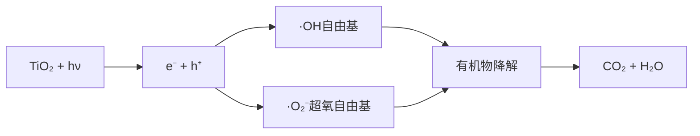
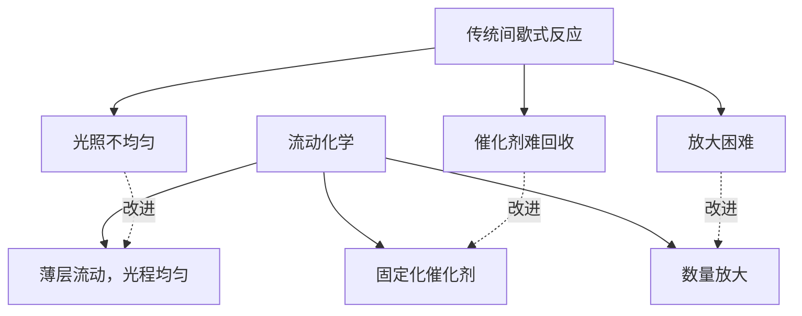
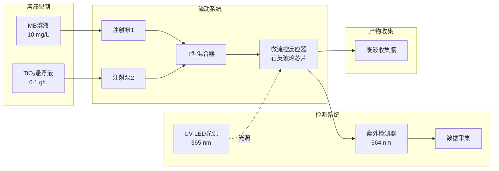
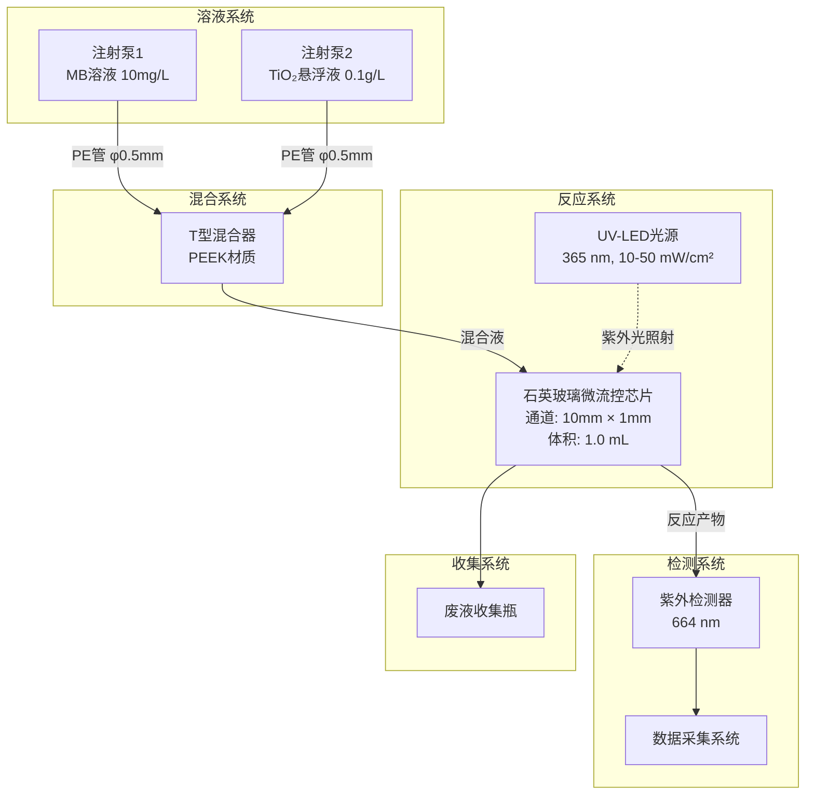
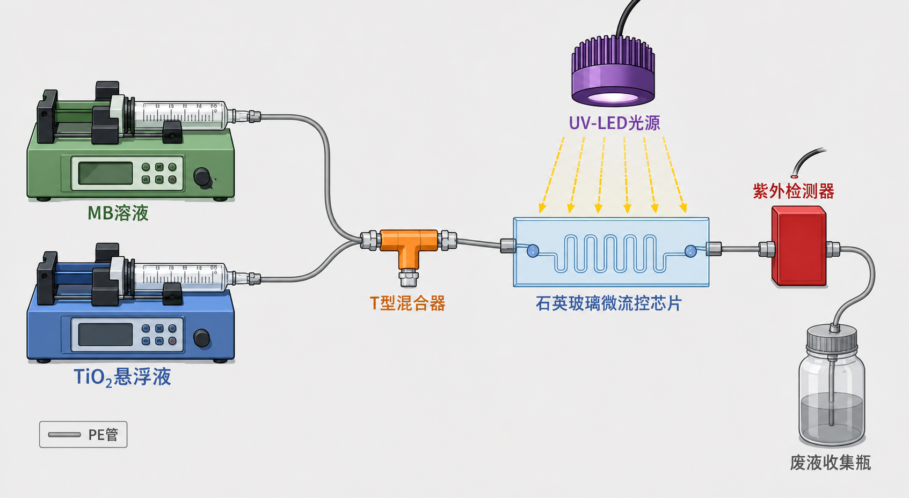
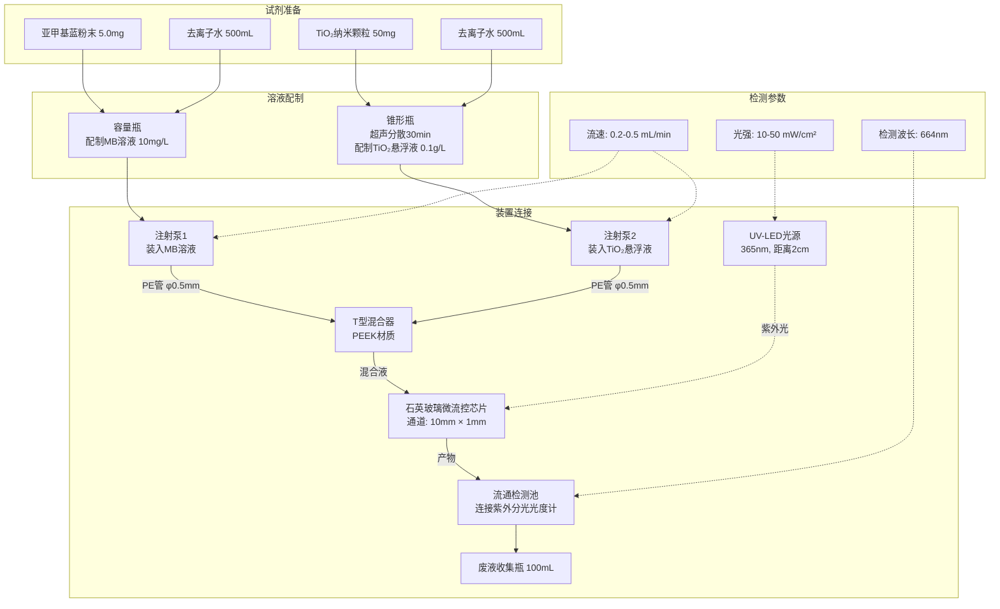
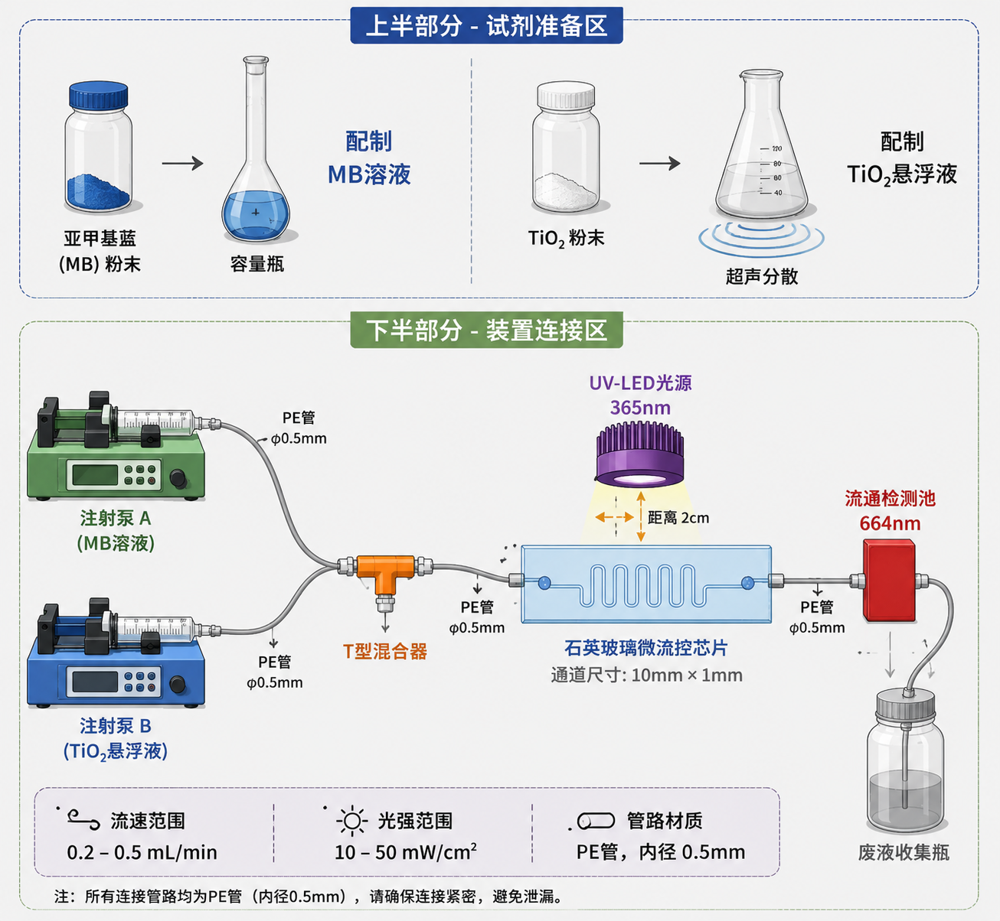

# 实验：流动化学光催化降解有机染料

## A. 实验目标

(1) 了解流动化学技术在光催化反应中的应用。

(2) 基于TiO₂光催化降解亚甲基蓝反应，探索连续流动化学技术在环境化学方面的应用。

(3) 通过改变流速和光强，研究流动化学条件下光催化反应的动力学特征。

(4) 对比传统间歇式反应与流动化学反应的效率差异。

## B. 实验器材

### (1) 仪器

| 仪器名称            | 规格/型号                  | 数量 | 用途         |
| ------------------- | -------------------------- | ---- | ------------ |
| 蠕动泵              | 0.1-10 mL/min              | 2台  | 驱动溶液流动 |
| 微流控芯片          | 石英玻璃，通道宽10mm×高1mm | 1片  | 反应器       |
| UV-LED光源          | 365 nm，可调光强           | 1套  | 提供紫外光   |
| 紫外-可见分光光度计 | -                          | 1台  | 检测MB浓度   |
| 烧杯                | 100 mL                     | 4个  | 配制溶液     |
| 锥形瓶              | 50 mL                      | 2个  | 收集产物     |
| 移液枪              | 100-1000 μL                | 1把  | 精确移液     |
| 计时器              | -                          | 1个  | 计时         |
| 温度计              | -                          | 1支  | 测温         |

### (2) 试剂

| 试剂名称       | 浓度/规格     | 用量    | 用途           |
| -------------- | ------------- | ------- | -------------- |
| 亚甲基蓝（MB） | 10 mg/L       | 500 mL  | 模型染料污染物 |
| TiO₂纳米颗粒   | 锐钛矿相，P25 | 50 mg   | 光催化剂       |
| 去离子水       | -             | 1000 mL | 配制溶液和冲洗 |
| 硫酸           | 0.1 mol/L     | 50 mL   | 调节pH         |

## C. 实验原理

### I. TiO₂光催化降解原理

TiO₂半导体在紫外光照射下产生电子-空穴对，进而生成活性氧物种（·OH、·O₂⁻等），可将有机染料氧化降解为CO₂和H₂O等无害产物。

**反应方程式：**

$$\text{MB} + \text{O}_2 \xrightarrow{\text{TiO}_2, h\nu} \text{CO}_2 + \text{H}_2\text{O} + \text{无机盐}$$

**朗伯-比尔定律：**

$$A = \lg\left(\frac{1}{T}\right) = Kbc$$

其中：
- $A$：吸光度
- $T$：透射比（透光度）
- $K$：摩尔吸光系数，与吸收物质的性质及入射光的波长λ有关
- $c$：吸光物质的浓度，单位为 mol/L
- $b$：吸收层厚度，单位为 cm

### II. 流动化学的优势

| 对比项目   | 传统间歇式 | 流动化学                 |
| ---------- | ---------- | ------------------------ |
| 光照均匀性 | 差，光程长 | 好，薄层流动             |
| 催化剂回收 | 需离心分离 | 固定化，无需分离         |
| 反应控制   | 粗放       | 精确控制停留时间         |
| 放大方式   | 体积放大   | 数量放大（numbering-up） |
| 光利用率   | 低         | 高表面积/体积比          |
| 温度控制   | 不均匀     | 微通道散热好             |

### III. 停留时间计算

反应液在微流芯片内的停留时间 $t$ 由下式计算：

$$t = \frac{V}{v_A + v_B}$$

其中：
- $t$ = 反应时间（反应液在微流芯片内的停留时间）
- $V$ = 微流芯片体积
- $v_A$ = A液流速
- $v_B$ = B液流速

## D. 实验内容

### 设备组装

按照下图组装流动化学装置：

**装置示意图：**

### I. 溶液配制

#### 步骤1：配制亚甲基蓝溶液（A液）

1. 用分析天平称取 5.0 mg 亚甲基蓝粉末
2. 将粉末转移至 500 mL 容量瓶中
3. 加入去离子水定容至 500 mL
4. 充分摇匀，得到 10 mg/L 的 MB 溶液
5. 将溶液转移至烧杯中，标记为"A液"

#### 步骤2：配制TiO₂悬浮液（B液）

1. 用分析天平称取 50 mg TiO₂纳米颗粒（P25）
2. 将粉末转移至 500 mL 锥形瓶中
3. 加入 500 mL 去离子水
4. 超声分散 30 min，得到 0.1 g/L 的 TiO₂ 悬浮液
5. 使用前再次摇匀，标记为"B液"

### II. 流动反应实验

#### 步骤3：装置准备

1. 检查蠕动泵是否正常工作
2. 用去离子水冲洗管路和微流控芯片，排除气泡
3. 将 UV-LED 光源放置在微流控芯片正上方，距离约 2 cm
4. 连接紫外-可见分光光度计的流通检测器

#### 步骤4：流动反应操作

1. 将 A液（MB溶液）装入注射泵1的注射器中
2. 将 B液（TiO₂悬浮液）装入注射泵2的注射器中
3. 设置注射泵1流速：0.2 mL/min
4. 设置注射泵2流速：0.2 mL/min
5. 开启蠕动泵，等待 2 min 使流动稳定
6. 开启 UV-LED 光源，开始计时
7. 在出口处收集流出液，每 2 min 收集一次样品
8. 用紫外-可见分光光度计测定每个样品在 664 nm 处的吸光度

#### 步骤5：改变流速实验

**降解率计算公式：**

## E. 结果处理

$$\text{降解率} = \frac{A_0 - A}{A_0} \times 100\%$$

### 1. 绘制降解率-流速曲线

以流速为横坐标，降解率为纵坐标，绘制曲线;

### 2. 绘制降解率-光强曲线

以光强为横坐标，降解率为纵坐标，绘制曲线;

### 3. 动力学分析

假设光催化降解反应符合一级动力学：

$$-\frac{d[\text{MB}]}{dt} = k_{app}[\text{MB}]$$

积分得：

$$\ln\frac{[\text{MB}]_0}{[\text{MB}]} = k_{app} \cdot t$$

即：

$$\ln\frac{A_0}{A} = k_{app} \cdot t$$

以停留时间 $t$ 为横坐标，$\ln(A_0/A)$ 为纵坐标作图，斜率即为表观速率常数 $k_{app}$。

### 4. 表观活化能计算

依据阿伦尼乌斯公式可估算出反应的表观活化能 $E_a$：

$$\ln\frac{k_2}{k_1} = \frac{E_a}{R} \cdot \frac{T_2 - T_1}{T_2 T_1}$$

其中：
- $k_1$, $k_2$：不同温度下的速率常数
- $T_1$, $T_2$：绝对温度（K）
- $R$：气体常数（8.314 J/(mol·K)）
- $E_a$：表观活化能（J/mol）

## F. 注意事项

### 安全注意事项

1. **UV光防护**：开启UV-LED时必须佩戴防护眼镜，避免直视光源
2. **化学品安全**：亚甲基蓝为染料，避免接触皮肤和衣物
3. **用电安全**：保持设备干燥，避免液体溅入电器设备

### 实验操作注意事项

1. **气泡排除**：实验前必须彻底排除管路和芯片中的气泡，否则会影响流动稳定性
2. **悬浮液均匀性**：TiO₂悬浮液使用前必须充分摇匀，避免沉降
3. **光强校准**：使用前用光功率计校准UV-LED光强
4. **温度控制**：长时间实验时注意光源发热对反应温度的影响
5. **清洗维护**：实验结束后用去离子水充分冲洗管路和芯片

### 数据处理注意事项

1. **平行实验**：每个条件至少重复3次，取平均值
2. **空白对照**：设置不光照的对照实验，排除热效应影响
3. **误差分析**：记录实验误差来源，进行不确定度分析

## G. 参考文献

1. Mills, A.; Le Hunte, S. An overview of semiconductor photocatalysis. *J. Photochem. Photobiol. A* **1997**, *108*, 1-35.

2. Hoffmann, M. R.; Martin, S. T.; Choi, W.; Bahnemann, D. W. Environmental applications of semiconductor photocatalysis. *Chem. Rev.* **1995**, *95*, 69-96.

3. Matsushita, Y.; Ichimura, T.; Ohba, N.; Kumada, S.; Sakeda, K.; Suzuki, T.; Tanibata, H.; Murata, T. Recent progress on photoreactions in microreactors. *Pure Appl. Chem.* **2007**, *79*, 1959-1968.

4. Sugimoto, A.; Fukuyama, T.; Rahman, M. T.; Ryu, I. An automated microflow system for the synthesis of a pharmaceutical intermediate via photogenerated singlet oxygen. *Tetrahedron Lett.* **2011**, *52*, 3522-3524.

5. Corning® Advanced-Flow™ Reactors. https://www.corning.com/

---

**附录：装置实物连接图**

