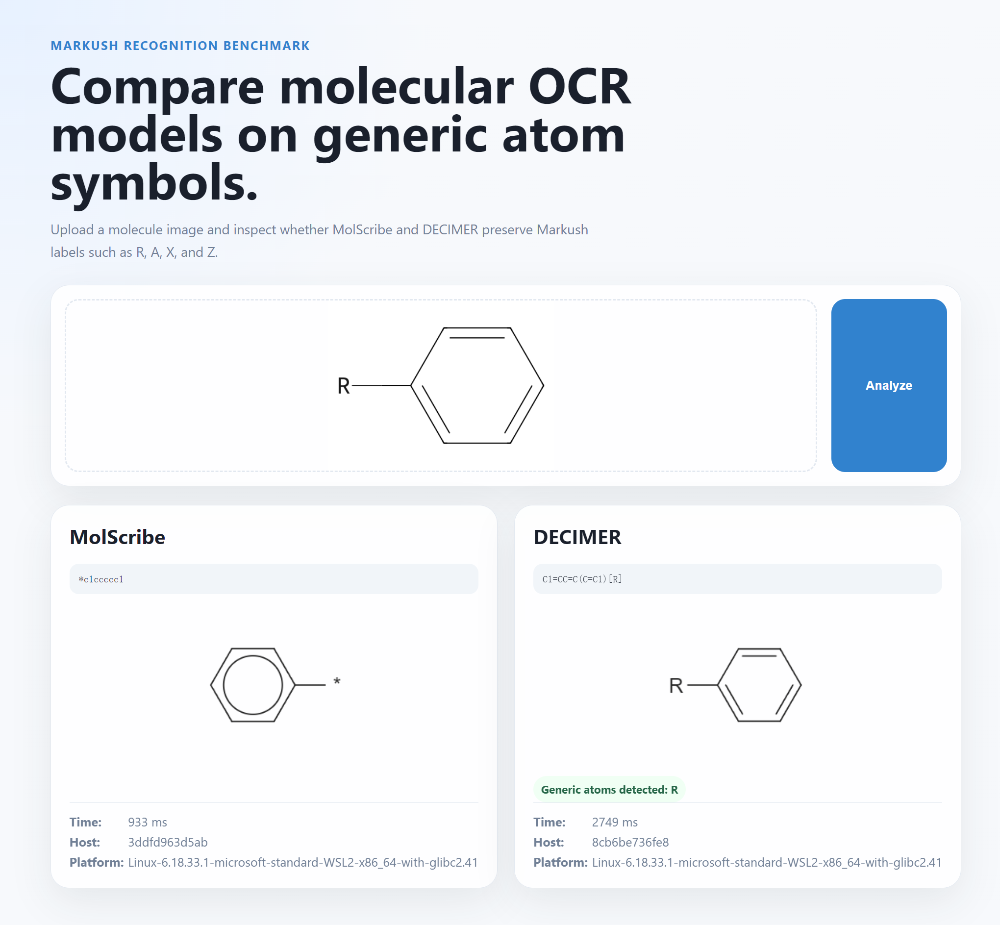

<p align="center">
  <b>中文</b> | <a href="README-en.md">English</a>
</p>

# Markush 识别基准测试

厦门大学《化学自动化》课程作业

## 背景

Markush 结构常见于化学专利图，用一个固定母核加一组可变占位符来覆盖一族相关化合物。WIPO 的 PATENTSCOPE 培训材料说明，Markush 公式会使用 `R`、`X`、`Y` 等占位符表示取代基、官能团或结构片段的变化。[^wipo-markush]

多数开源分子结构识别模型的目标是把普通化学图转换成完全确定的分子图或 SMILES。对于 Markush 图来说，这会形成一个很有价值的压力测试：模型可能输出一个语法有效的普通分子，却悄悄删除或改写了专利 claim 中真正重要的通用标签。

本项目是一个 CPU-only 的小型基准测试工具。默认 WebUI 只比较 MolScribe 和 DECIMER 两个可稳定启动的模型，展示它们是否保留 Markush 标签，并记录简单的运行时间和系统信息，便于控制变量对比。

## 示例

<p align="center">
  
</p>

截图使用 `B001_phenyl_R.png`，即带 R-group 占位符的苯环。MolScribe 返回带通配原子的普通结构输出，DECIMER 保留了 `[R]` 标签。每张卡片还显示了该模型服务的耗时和系统信息。

## 项目技术路线

项目采用简单的服务化结构：

1. `data/generate_dataset.py` 生成测试 PNG 和 metadata，其中包含普通分子和带 Markush 占位符的图像。
2. 每个模型运行在独立 FastAPI 容器中，并暴露相同的 `/health` 和 `/predict` 接口。
3. React/Vite WebUI 将同一张图片并行上传给默认模型服务。
4. 每张模型卡显示 SMILES、结构渲染结果、通用符号检测、预测耗时、容器 hostname 和 platform。
5. Docker Compose 默认只启动稳定服务：MolScribe、DECIMER 和 WebUI。

默认栈不包含数据库、认证、队列或 GPU 依赖，目标是在普通开发机上保持可复现，并尽量减少非模型因素对对比结果的影响。

## 快速开始

```bash
git clone https://github.com/alkali210/markush-benchmark.git
cd markush-benchmark
docker-compose up --build
# 打开 http://localhost:5173
```

默认 Compose 栈只启动 MolScribe、DECIMER 和 WebUI。MarkushGrapher-2 不会默认加载。

## 首次启动说明

首次启动会自动下载默认模型权重。第一次 `docker-compose up --build` 可能需要较长时间，取决于网络速度；后续启动会复用 Docker 命名卷中的缓存。

## 生成测试数据集

```bash
pip install rdkit-pypi Pillow cairosvg
cd data && python generate_dataset.py
```

如果本机 Python 或 NumPy 版本较新，可以使用 Python 3.11 并固定 NumPy 版本：

```bash
py -3.11 -m pip install "numpy<2" rdkit-pypi Pillow cairosvg
py -3.11 data/generate_dataset.py
```

脚本会生成 PNG 图片并更新 `data/metadata.json`。

## 默认模型

### MolScribe

MolScribe 是一个 image-to-graph 分子结构识别模型。论文中将它描述为显式预测原子、化学键和几何布局，而不是只把图片当作 image-to-string 任务。[^molscribe-paper] 在本项目中，MolScribe 作为现代 OCSR 基线，用来观察图结构模型在 Markush-like 图像中是否保留通用原子标签。

### DECIMER

DECIMER 是一个开放的光学化学结构识别平台，用于从图像和文档中识别化学结构。DECIMER.ai 论文描述了用于自动化 OCSR 工作流的深度学习平台，包括化学图像分类和结构识别组件。[^decimer-paper] 在本项目中，DECIMER 的输出通常是直接可比较的 SMILES，并且在部分 Markush 示例中能保留 `[R]` 等通用标签。

## API

每个默认模型服务都提供相同接口：

- `GET /health`
- `POST /predict`，接收 `multipart/form-data`，字段名为 `file`

`/predict` 返回：

```json
{
  "smiles": "...",
  "confidence": null,
  "error": null,
  "model": "DECIMER",
  "duration_ms": 1234,
  "runtime": {
    "hostname": "container-hostname",
    "platform": "Linux-..."
  }
}
```

`duration_ms` 是服务端处理该模型预测请求的耗时。`hostname` 和 `platform` 用于确认模型运行在哪个容器和系统环境中，方便做控制变量对比。

## 实验性可选模型：MarkushGrapher-2

MarkushGrapher-2 是面向 Markush 结构的专用识别模型，适合后续实验，但它不是默认 Compose 栈的一部分。官方仓库将 MarkushGrapher-2 描述为用于从化学文档图像中识别分子结构和 Markush 结构的端到端多模态模型。[^markushgrapher-repo] Hugging Face 模型卡也说明它面向专利文档，并联合编码视觉和文本信息。[^markushgrapher-hf]

它没有默认启用，原因是 CPU 推理流程资源占用高，需要下载多个大型模型文件，并且推理时可能阻塞 API 进程。除非明确要测试 MarkushGrapher-2，否则默认基准测试应只使用 MolScribe 和 DECIMER。

## 更多模型适配

其它 OCSR 模型可以按同一个适配层接入：为模型新建 `services/<model>-api/`，实现 `GET /health` 和 `POST /predict`，让 `/predict` 返回与默认服务相同的 JSON 字段，然后在 `docker-compose.yml` 和 `webui/src/api/client.js` 中显式加入该服务。

最小适配思路：

```python
@app.post("/predict")
async def predict(file: UploadFile = File(...)):
    start = time.perf_counter()
    try:
        # 1. 保存上传图片到 tempfile
        # 2. 调用模型自己的 inference API
        # 3. 返回 smiles/confidence/error/model/duration_ms/runtime
        return {"smiles": smiles, "confidence": None, "error": None, "model": "NewModel"}
    except Exception as exc:
        return {"smiles": None, "confidence": None, "error": str(exc), "model": "NewModel"}
```

## 已知问题

- `docker compose config` 在新版 Compose v2 中会提示顶层 `version` 字段已过时。
- 某些 Python/NumPy 组合可能与 `rdkit-pypi` wheel 不兼容；本地验证中 Python 3.11 和 `numpy<2` 可用。

[^wipo-markush]: WIPO, “Markush searches in PATENTSCOPE”, https://www.wipo.int/documents/d/patentscope/docs-en-markush-searches.pdf

[^molscribe-paper]: Qian 等, “MolScribe: Robust Molecular Structure Recognition with Image-to-Graph Generation”, *Journal of Chemical Information and Modeling*, https://pubs.acs.org/doi/10.1021/acs.jcim.2c01480

[^decimer-paper]: Rajan 等, “DECIMER.ai: an open platform for automated optical chemical structure identification, segmentation and recognition in scientific publications”, *Nature Communications*, https://www.nature.com/articles/s41467-023-40782-0

[^markushgrapher-repo]: DS4SD, “MarkushGrapher”, https://github.com/DS4SD/MarkushGrapher

[^markushgrapher-hf]: docling-project, “MarkushGrapher-2”, https://huggingface.co/docling-project/MarkushGrapher-2
